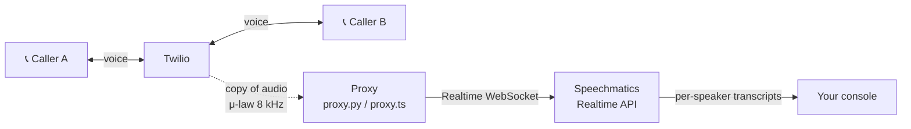

import Tabs from '@theme/Tabs';
import TabItem from '@theme/TabItem';

# Twilio integration

:::info
This is a **reference implementation** — you clone it, run it, and adapt it. It's not a hosted service or a Twilio Marketplace add-on.
:::

[Twilio](https://www.twilio.com) lets you make and receive phone calls from your code. Its [Media Streams](https://www.twilio.com/docs/voice/media-streams) feature sends a live copy of any call's audio to a URL you control — perfect for real-time transcription, without touching the call itself.

This guide walks you through a small proxy that takes that audio stream and feeds it into Speechmatics Realtime, printing per-caller transcripts to your console as the call unfolds. The [reference repo](https://github.com/speechmatics/speechmatics-twilio-integration) ships the same proxy in two languages — [Python](https://github.com/speechmatics/speechmatics-twilio-integration/tree/main/python) and [Node.js](https://github.com/speechmatics/speechmatics-twilio-integration/tree/main/js) — so pick whichever fits your team.

## How it works

Here's what runs where before we get to the commands:



- **Caller A** dials your Twilio number which forwards to **Caller B** — the two talk like a direct call.
- Twilio sends a **live copy of the audio** to your proxy over a WebSocket.
- The proxy hands that audio to Speechmatics  with [channel diarization](/speech-to-text/features/diarization) turned on. 
- Each speaker (`inbound` from Caller A, `outbound` from Caller B) gets its own transcript stream.
- Speechmatics returns transcripts, and the proxy prints them under per-channel labels.

Everything runs on your machine. [ngrok](https://ngrok.com) gives Twilio a public URL to reach you.

## Before you begin

You'll need:

- A Speechmatics API key from the [Speechmatics portal](https://portal.speechmatics.com).
- A [Twilio account](https://www.twilio.com), a voice-capable Twilio phone number, your Account SID, and your Auth Token.
- A **second** phone number you own or have verified with Twilio to call.
- An [ngrok](https://ngrok.com) account and auth token.
- Python 3.9+ or Node.js 20+, depending on which implementation you pick.

## Clone the reference repo

Both implementations live in one repo. Clone it and change into the folder:

```bash
git clone https://github.com/speechmatics/speechmatics-twilio-integration.git
cd speechmatics-twilio-integration
```

Inside, you'll find a [`python/`](https://github.com/speechmatics/speechmatics-twilio-integration/tree/main/python) folder and a [`js/`](https://github.com/speechmatics/speechmatics-twilio-integration/tree/main/js) folder alongside a shared [`.env.example`](https://github.com/speechmatics/speechmatics-twilio-integration/blob/main/.env.example) at the root. Both implementations read from the same `.env`, so you set your credentials once and can flip between languages freely.

## Set your credentials

Copy the template:

```bash
cp .env.example .env
```

Open `.env` in your editor and the environment variables. The proxy won't run if any are missing.

| Variable | What to put here |
|---|---|
| `SPEECHMATICS_API_KEY` | Your Speechmatics Realtime API key. |
| `NGROK_AUTHTOKEN` | Your ngrok auth token from the ngrok dashboard. |
| `TWILIO_ACCOUNT_SID` | Your Twilio Account SID — it starts with `AC`. |
| `TWILIO_AUTH_TOKEN` | Your Twilio Auth Token. |
| `TWILIO_PHONE_NUMBER` | Your Twilio number in E.164 form, e.g. `+442475429721`. |
| `FORWARD_TO_NUMBER` | The E.164 number the call bridges to — the second speaker. |

## Install and run

<Tabs groupId="language">
<TabItem value="python" label="Python">

Move into `python/` and set up a virtualenv:

```bash
cd python
python -m venv .venv
source .venv/bin/activate
pip install -r requirements.txt
```

Start the proxy:

```bash
python proxy.py
```

</TabItem>
<TabItem value="javascript" label="Node.js">

Move into `js/` and install dependencies:

```bash
cd js
npm install
```

Start the proxy:

```bash
npm start
```

</TabItem>
</Tabs>

You'll see a banner like this:

```
Listening on ws://localhost:5000/twilio
Twilio number +XX... pointed at wss://abc123.../twilio. Call it now.
```

## Make your first call

With the proxy running, dial your Twilio number from any phone.

1. Twilio answers the incoming call, plays the short greeting, then dials `FORWARD_TO_NUMBER`.
2. Answer the second phone. You're now on a normal two-way call.
3. Speak into either handset. Transcripts appear in the console within seconds:

```
[twilio] incoming Media Streams connection
[twilio] call started - stream=MZxxx... call=CAxxx... tracks=['inbound', 'outbound']
[inbound ] Hello there. How are you doing today?
[outbound] I'm doing pretty well thanks.
[twilio] call stopped (stream=MZxxx...)
```

- **inbound** — whoever dialed your Twilio number.
- **outbound** — whoever answered `FORWARD_TO_NUMBER`.

When you're done, press `Ctrl-C` in the terminal to stop the proxy. Your Twilio number's Voice URL stays pointed at the last ngrok tunnel — the next run overwrites it, so you never have to touch the Twilio Console after the first time.

## What the proxy does under the hood

Once a call arrives, the proxy has three jobs:

1. **Receive Twilio's audio.** Twilio sends 20 ms of μ-law-encoded 8 kHz mono audio at a time — 160 bytes per frame. Each frame arrives on the WebSocket as a JSON `media` event with a base64 `payload` and a `track` label (`inbound` or `outbound`). The proxy uses that label to keep the two speakers apart.
2. **Forward the audio to Speechmatics as-is.** Speechmatics Realtime accepts μ-law 8 kHz directly, so the proxy passes bytes straight through without re-encoding. That keeps latency down and avoids audio-quality loss.
3. **Ask Speechmatics for per-channel transcripts.** The session is configured with `diarization: "channel"` and channel labels `["inbound", "outbound"]`. Every transcript that comes back carries a `channel` field, and the proxy prints it under the matching label.

## Troubleshooting

| Problem | What to try |
|---|---|
| **`Missing required env vars in .env: ...`** | Copy `.env.example` to `.env` at the repo root and fill in every listed value. Both languages read the same file. |
| **`Twilio number ... not found on this account`** | Check `TWILIO_PHONE_NUMBER` is in E.164 form (leading `+`, country code, no spaces) and belongs to the account whose SID and token you're using. |
| **Twilio Debugger shows `21219 - 'To' phone number not verified`** | Your Twilio account is in trial mode. Add `FORWARD_TO_NUMBER` at [Verified Caller IDs](https://console.twilio.com/us1/develop/phone-numbers/manage/verified), or upgrade the account. |
| **The caller hears "an application error has occurred"** | Open the [Twilio Debugger](https://console.twilio.com/us1/monitor/logs/debugger) for the specific error code. Confirm ngrok is still running and the URL in the startup banner matches your number's Voice URL in the Twilio Console. |
| **No transcripts appear** | Confirm you heard the "This call is being transcribed" greeting — that proves Twilio reached `/twiml`. If not, the proxy isn't reachable. If yes but transcripts still don't come through, double-check `SPEECHMATICS_API_KEY`. |

Still stuck? See [Twilio support](https://support.twilio.com) or [contact Speechmatics](https://www.speechmatics.com/company/contact).

## Next steps

- [Learn about channel diarization](/speech-to-text/features/diarization)
- [Explore all supported languages](/speech-to-text/languages)
- [Read the Realtime API reference](/speech-to-text/realtime/quickstart)
- [Browse more integrations in the Speechmatics Academy](https://github.com/speechmatics/speechmatics-academy)
