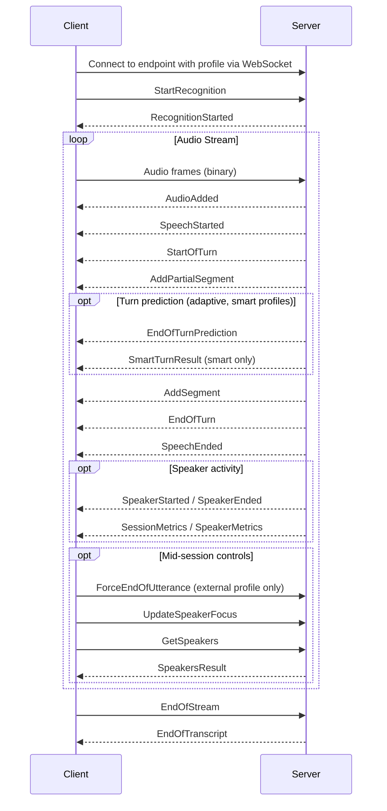

# Voice Agent API

:::warning
- The Voice Agent API is a preview offering and should **not be used for live production traffic**. The system will be less stable than our production endpoints and features may change.
- There are no uptime or performance SLAs.
- There are no data residency guarantees. Data processing may occur in both US and EU regions.
- Preview features may be cancelled at any time or never be released publicly.
:::

## Introduction

The Voice Agent API is a WebSocket API for building voice agents. Stream audio in and receive speaker-labelled, turn-based transcription back — clean, punctuated, and ready to pass directly to an LLM.

Turn detection runs server-side. Choose a [profile](#profiles) based on your use case and the API handles when to finalise each speaker's turn.

**Looking for code examples?** See working examples in [Speechmatics Academy](https://github.com/speechmatics/speechmatics-academy/tree/main/basics/11-voice-api-explorer) for Python and JavaScript.

---

## Profiles

Profiles are pre-configured turn detection modes. Each profile sets the right defaults for your use case — you choose one when connecting, include it in your endpoint URL, and the server handles the rest.

| Profile | Turn detection | Best for |
|---------|---------------|----------|
| `adaptive` | Adapts to speaker pace and hesitation | General conversational agents |
| `agile` | VAD-based silence detection | Speed-first use cases |
| `smart` | `adaptive` + ML acoustic turn prediction | High-stakes conversations |
| `external` | Manual — you trigger turn end | Push-to-talk, custom VAD, LLM-driven |

### `adaptive`

**Endpoint:** `/v2/agent/adaptive`

Adapts to each speaker's pace over the course of a conversation. It adjusts the turn-end threshold based on speech rate and disfluencies (e.g. hesitations, filler words), waiting longer for speakers who tend to pause mid-thought.

**Best for:** General conversational voice agents.

**Trade-off:** Latency varies by speaker. Disfluency detection is English-only — other languages fall back to speech-rate adaptation.

### `agile`

**Endpoint:** `/v2/agent/agile`

Uses voice activity detection (VAD) to detect silence and finalise turns as quickly as possible. The lowest latency profile.

**Best for:** Use cases where response speed is the top priority and occasional mid-speech finalisations are acceptable.

**Trade-off:** Because it relies on silence, it may finalise a turn while the speaker is still mid-sentence — for example, during a natural pause. This can result in additional downstream LLM calls.

### `smart`

**Endpoint:** `/v2/agent/smart`

Builds on `adaptive` with an additional ML model that analyses acoustic cues to predict whether a speaker has genuinely finished their turn. The most conservative profile — least likely to interrupt.

**Best for:** High-stakes conversations where cutting off the user is costly — finance, healthcare, legal.

**Trade-off:** Higher latency than `adaptive`. Supported languages: Arabic, Bengali, Chinese, Danish, Dutch, English, Finnish, French, German, Hindi, Indonesian, Italian, Japanese, Korean, Marathi, Norwegian, Polish, Portuguese, Russian, Spanish, Turkish, Ukrainian, Vietnamese.

### `external`

**Endpoint:** `/v2/agent/external`

Turn detection is fully manual. The server accumulates audio and transcript until you send a `ForceEndOfUtterance` message, at which point it finalises everything spoken up to that point and emits an `AddSegment`.

**Best for:** Push-to-talk interfaces, custom VAD pipelines, or setups where an LLM decides when to respond.

**Trade-off:** You are responsible for all turn detection logic.

---

## Session Flow

Every session follows the same structure: connect, start recognition, stream audio, receive turn events, close.



For a full reference of all messages, see [Messages Overview](#messages-overview).

---

## Getting Started

### 1. Connect

Open a WebSocket connection to the preview endpoint. To do this, you must specify the [profile](#profiles) to use:

```
wss://preview.rt.speechmatics.com/v2/agent/<profile>
```

### 2. Authenticate

Authenticate every connection using one of the following:

| Method | Format |
|--------|--------|
| Header (API key) | `Authorization: Bearer <SPEECHMATICS_API_KEY>` |
| Header (JWT) | `Authorization: Bearer <JWT_TEMPORARY_KEY>` |
| Query parameter (API key) | `?api_key=<SPEECHMATICS_API_KEY>` |
| Query parameter (JWT) | `?jwt=<JWT_TEMPORARY_KEY>` |

See [Authentication](/get-started/authentication) for details including temporary keys.

### 3. Start the session

Send [`StartRecognition`](#startrecognition) as your first message:

```json
{
  "message": "StartRecognition",
  "transcription_config": {
    "language": "en"
  }
}
```
For all configuration options, see [Configuration](#configuration).

The server responds with `RecognitionStarted` when the session is ready. You should wait for this message before sending audio.


### 4. Stream audio and handle responses

Send audio as binary WebSocket frames. Turn events will arrive in real time as the API processes speech — see [Session Flow](#session-flow) for the full message sequence.

---

## Configuration

Configuration is passed in [`StartRecognition`](#startrecognition) and is split across two levels of the payload: `audio_format` (top-level) and `transcription_config`.

**`audio_format`**

:::warning
Only `pcm_s16le` at `8000` or `16000` Hz is supported. Other encodings (e.g. `pcm_f32le`, `mulaw`) and sample rates (e.g. `44100`) may be silently accepted by the API but will not produce correct output.
:::

| Field | Notes |
|-------|-------|
| `type` | Must be `raw` |
| `encoding` | Must be `pcm_s16le` (16-bit signed little-endian PCM) |
| `sample_rate` | Must be `8000` or `16000` |

Example: `{"type":"raw","encoding":"pcm_s16le","sample_rate":16000}`

**`transcription_config`**

| Field | Default | Notes |
|-------|---------|-------|
| `language` | `en` | All supported languages |
| `output_locale` | — | Output locale (e.g. `en-US`) |
| `additional_vocab` | — | Custom vocabulary entries |
| `punctuation_overrides` | — | Custom punctuation rules |
| `domain` | — | Domain-specific model (e.g. `medical`) |
| `enable_entities` | `false` | Entity detection |
| `enable_partials` | `true` | Emit partial segments during speech |
| `diarization` | `speaker` | Speaker diarization; `none` to disable |
| `volume_threshold` | — | Minimum audio volume to process |

**`transcription_config.speaker_diarization_config`**

Note: The following require `diarization: speaker` to be set.
| Field | Default | Notes |
|-------|---------|-------|
| `max_speakers` | — | Maximum number of speakers to track |
| `speaker_sensitivity` | — | Sensitivity of speaker separation |
| `prefer_current_speaker` | — | Bias toward the most recently active speaker |
| `known_speakers` | — | Pre-enrolled speaker identifiers for cross-session recognition (see [Speaker ID](#speaker-id)) |

**Not supported — will be rejected if present**

| Field | Notes |
|-------|-------|
| `translation_config` | Not supported on this endpoint |
| `audio_events_config` | Not supported on this endpoint |

---

## Messages Overview

All messages exchanged during a Voice Agent API session. For payload details, see the API Reference sections.

### Client → Server

| Message | When to send |
|---------|-------------|
| [`StartRecognition`](#startrecognition) | First message after connecting. Starts the session and passes configuration. |
| Audio frames | Binary WebSocket frames containing raw PCM audio, sent continuously. |
| [`ForceEndOfUtterance`](#forceendofutterance) | `external` profile only. Triggers immediate turn finalisation. |
| [`UpdateSpeakerFocus`](#updatespeakerfocus) | Any time during the session. Changes which speakers are in focus. |
| [`GetSpeakers`](#getspeakers) | Any time during the session. Requests voice identifiers for diarized speakers. |
| [`EndOfStream`](#endofstream) | When there is no more audio to send. |

### Server → Client

**Core turn events** — the messages your agent logic acts on

| Message | Profile | When it's emitted |
|---------|---------|------------------|
| [`StartOfTurn`](#startofturn) | All | A speaker begins a new turn |
| [`AddPartialSegment`](#addpartialsegment) | All | Interim transcript update; each replaces the previous |
| [`AddSegment`](#addsegment) | All | Final transcript for the turn — pass this to your LLM |
| [`EndOfTurn`](#endofturn) | All | Turn complete; your agent can now respond |

**Turn prediction** — early signals you can use to prepare a response

| Message | Profile | When it's emitted |
|---------|---------|------------------|
| [`EndOfTurnPrediction`](#endofturnprediction) | `adaptive`, `smart` | The model predicts the current turn will end soon |
| [`SmartTurnResult`](#smartturnresult) | `smart` only | High-confidence acoustic prediction of turn completion |

**Speech and speaker activity**

| Message | Profile | When it's emitted |
|---------|---------|------------------|
| [`SpeechStarted`](#speechstarted--speechended) | All | Voice activity detected in the audio stream |
| [`SpeechEnded`](#speechstarted--speechended) | All | Voice activity stopped |
| [`SpeakerStarted`](#speakerstarted--speakerended) | All | A specific diarized speaker began talking |
| [`SpeakerEnded`](#speakerstarted--speakerended) | All | A specific diarized speaker stopped talking |
| [`SpeakersResult`](#speakersresult) | All | Response to `GetSpeakers` |

**Session lifecycle**

| Message | When it's emitted |
|---------|------------------|
| `RecognitionStarted` | Session ready; emitted in response to `StartRecognition` |
| `AudioAdded` | Audio frame acknowledged |
| `EndOfTranscript` | Session closing; emitted by the proxy after `EndOfStream` |

**Metrics and diagnostics**

| Message | When it's emitted |
|---------|------------------|
| [`SessionMetrics`](#sessionmetrics) | Session stats; emitted every 5 seconds and at session end |
| [`SpeakerMetrics`](#speakermetrics) | Per-speaker word count and volume; emitted on each recognised word |

**Shared messages with the RT API** - messages shared with the RT API. See the [RT API Reference](/api-ref) for full payload details.

| Message | When it's emitted |
|---------|------------------|
| `EndOfUtterance` | Silence threshold reached; precedes turn finalisation |
| `Info` | Non-critical informational message |
| `Warning` | Non-fatal issue (e.g. unsupported config field ignored) |
| `Error` | Fatal error; connection will close |

---

## API Reference - Client Messages

#### StartRecognition

The first message you send after connecting. Starts the recognition session and passes configuration. 
The server responds with `RecognitionStarted`.

```json
{
  "message": "StartRecognition",
  "audio_format": {
    "type": "raw",
    "encoding": "pcm_s16le",
    "sample_rate": 16000
  },
  "transcription_config": {
    "language": "en"
  }
}
```

For all configuration options, see [Configuration](#configuration).

#### EndOfStream

Send when you have finished streaming audio. The server finalises any remaining transcript and then emits `EndOfTranscript`.

`last_seq_no` is the sequence number of the last audio frame you sent.
```json
{
  "message": "EndOfStream",
  "last_seq_no": 1234
}
```

#### ForceEndOfUtterance

Only applies to the `external` profile. Immediately ends the current turn — the server finalises all audio received so far and emits a single `AddSegment` containing the complete transcript for that turn, followed by `EndOfTurn`.

Use this wherever your application decides a turn is complete: on button release (push-to-talk), on VAD silence, or on an LLM signal.

```json
{
  "message": "ForceEndOfUtterance"
}
```

#### UpdateSpeakerFocus

Updates which speakers are in focus, mid-session. Takes effect immediately. See [Speaker Focus](#speaker-focus) for full details.

```json
{
  "message": "UpdateSpeakerFocus",
  "speaker_focus": {
    "focus_speakers": ["S1"],
    "ignore_speakers": [],
    "focus_mode": "retain"
  }
}
```

#### GetSpeakers

Requests voice identifiers for all speakers diarized so far in the session. The server responds with a `SpeakersResult` message. See [Speaker ID](#speaker-id) for full details.

```json
{
  "message": "GetSpeakers"
}
```

---

## API Reference - Server Messages

This section covers Voice Agent API-specific messages only. For shared messages (`RecognitionStarted`, `AudioAdded`, `AddPartialTranscript`, `AddTranscript`, `EndOfUtterance`, `EndOfTranscript`, `Info`, `Warning`, `Error`), see the [RT API reference](/api-ref).

#### StartOfTurn

Emitted when a speaker begins a new turn. Use this to signal to your agent that it should stop speaking if it currently is.

```json
{
  "message": "StartOfTurn",
  "turn_id": 42
}
```

**Fields:**
- `turn_id` — monotonically increasing integer; pairs with the corresponding `EndOfTurn`

#### EndOfTurn

Emitted when turn detection decides the speaker has finished. This is the trigger for your agent to respond. The finalised transcript for the turn is in the preceding `AddSegment`.

```json
{
  "message": "EndOfTurn",
  "turn_id": 42,
  "metadata": {
    "start_time": 0.84,
    "end_time": 3.24
  }
}
```

**Fields:**
- `turn_id` — matches the `StartOfTurn` for this turn
- `metadata.start_time` / `metadata.end_time` — audio time range for the turn, in seconds from session start

#### AddPartialSegment

Interim transcript update emitted continuously while the speaker is talking. Each new `AddPartialSegment` replaces the previous one — do not concatenate them.

```json
{
  "message": "AddPartialSegment",
  "segments": [
    {
      "speaker_id": "S1",
      "is_active": true,
      "timestamp": "2025-01-01T12:00:00.000+00:00",
      "language": "en",
      "text": "Good evening",
      "is_eou": false,
      "metadata": {
        "start_time": 0.84,
        "end_time": 1.24
      }
    }
  ],
  "metadata": {
    "start_time": 0.84,
    "end_time": 1.24,
    "processing_time": 0.23
  }
}
```

#### AddSegment

The final, complete transcript for a turn. Emitted just before `EndOfTurn`. This is the stable output to pass to your LLM — do not use `AddPartialSegment` for this.

In multi-speaker scenarios, a single `AddSegment` may contain segments from multiple speakers, returned in time order.

```json
{
  "message": "AddSegment",
  "segments": [
    {
      "speaker_id": "S1",
      "is_active": true,
      "timestamp": "2025-01-01T12:00:00.000+00:00",
      "language": "en",
      "text": "Good evening.",
      "is_eou": true,
      "metadata": {
        "start_time": 0.84,
        "end_time": 1.56
      }
    }
  ],
  "metadata": {
    "start_time": 0.84,
    "end_time": 1.56,
    "processing_time": 0.25
  }
}
```

**Segment fields:**
- `speaker_id` — speaker label (e.g. `S1`, `S2`, or a custom label if using [Speaker ID](#speaker-id))
- `is_active` — `true` if this speaker is in your current focus list; `false` if they are a background speaker (see [Speaker Focus](#speaker-focus))
- `is_eou` — `true` on final segments, `false` on partials
- `text` — clean, punctuated transcript text
- `metadata.start_time` / `metadata.end_time` — time range of this segment in seconds from session start

**Message-level fields:**
- `metadata.processing_time` — transcription latency in seconds for this message

#### SpeakerStarted / SpeakerEnded

Emitted when a specific speaker starts or stops being heard. These are voice activity events — they fire based on detected speech, independently of turn boundaries.

```json
{
  "message": "SpeakerStarted",
  "speaker_id": "S1",
  "is_active": true,
  "time": 0.84,
  "metadata": { "start_time": 0.84, "end_time": 0.84 }
}
```

```json
{
  "message": "SpeakerEnded",
  "speaker_id": "S1",
  "is_active": true,
  "time": 3.24,
  "metadata": { "start_time": 0.84, "end_time": 3.24 }
}
```

**Fields:**
- `speaker_id` — the speaker whose activity changed
- `is_active` — whether this speaker is in your current focus list
- `time` — seconds from session start when the activity was detected
- `metadata.start_time` — when this speaker started their current speaking interval
- `metadata.end_time` — when this speaker stopped speaking (`SpeakerEnded` only)

#### SessionMetrics

Emitted every 5 seconds and once at the end of the session.

```json
{
  "message": "SessionMetrics",
  "total_time": 4.6,
  "total_time_str": "00:00:04",
  "total_bytes": 148480,
  "processing_time": 0.295
}
```

#### SpeakerMetrics

Emitted each time a speaker produces a recognised word.

```json
{
  "message": "SpeakerMetrics",
  "speakers": [
    {
      "speaker_id": "S1",
      "word_count": 6,
      "last_heard": 2.36,
      "volume": 5.2
    }
  ]
}
```

#### SpeakersResult

Emitted in response to `GetSpeakers`. Contains voice identifiers for all diarized speakers so far. See [Speaker ID](#speaker-id) for how to store and use these.

```json
{
  "message": "SpeakersResult",
  "speakers": [
    { "label": "S1", "speaker_identifiers": ["<id1>"] },
    { "label": "S2", "speaker_identifiers": ["<id2>"] }
  ]
}
```

#### EndOfTurnPrediction

Emitted by `adaptive` and `smart` profiles when the model predicts the current turn is about to end. Can be used to begin preparing a response before `EndOfTurn` arrives, reducing perceived latency.

```json
{
    "message": "EndOfTurnPrediction",
    "turn_id": 2,
    "predicted_wait": 0.73,
    "metadata": {
        "ttl": 0.73,
        "reasons": ["not__ends_with_eos"]
    }
}
```

**Fields:**
- `turn_id` — the turn this prediction applies to
- `predicted_wait` — estimated seconds until the turn ends
- `metadata.ttl` — time to live; how long this prediction remains valid
- `metadata.reasons` — internal signals that contributed to the prediction

#### SmartTurnResult

:::warning
This message is currently emitted as `SmartTurnResult` during preview. It will be renamed to `SmartTurnPrediction` at GA.
:::

Emitted by the `smart` profile only. A higher-confidence acoustic prediction of turn completion, based on the ML model that analyses vocal cues.

```json
{
    "message": "SmartTurnResult",
    "prediction": {
        "prediction": true,
        "probability": 0.979,
        "processing_time": 0.128
    },
    "metadata": {
        "start_time": 0.0,
        "end_time": 2.2,
        "language": "en",
        "speaker_id": "S1",
        "total_time": 2.2
    }
}
```

**Fields:**
- `prediction.prediction` — `true` if the model predicts the turn is complete
- `prediction.probability` — confidence score (0–1)
- `prediction.processing_time` — time taken by the ML model in seconds
- `metadata.start_time` / `metadata.end_time` — audio window analysed
- `metadata.total_time` — total session time at point of prediction
- `metadata.speaker_id` — speaker being analysed (`null` if not yet identified)

#### SpeechStarted / SpeechEnded

Voice activity detection events. Emitted when speech is first detected in the audio stream (`SpeechStarted`) or stops (`SpeechEnded`). These fire independently of speaker identity and turn boundaries.

```json
{
    "message": "SpeechStarted",
    "probability": 0.508,
    "transition_duration_ms": 192.0,
    "metadata": {
        "start_time": 2.1,
        "end_time": 2.1
    }
}
```

```json
{
    "message": "SpeechEnded",
    "probability": 0.307,
    "transition_duration_ms": 192.0,
    "metadata": {
        "start_time": 0.4,
        "end_time": 2.5
    }
}
```

**Fields:**
- `probability` — VAD confidence score (0–1)
- `transition_duration_ms` — duration of the speech/silence transition in milliseconds
- `metadata.start_time` — when speech began (`SpeechStarted`: same as `end_time`; `SpeechEnded`: when the speaking interval started)
- `metadata.end_time` — when the event was detected

---

## Features

### Speaker Focus

Speaker focus lets you control which speakers' output your agent acts on. By default, all detected speakers are active and their transcripts are included in `AddSegment` output.

Speaker IDs (`S1`, `S2`, etc.) are assigned automatically when diarization is enabled, and persist for the lifetime of the session. Send `UpdateSpeakerFocus` at any point during the session to change who is in focus — the new config takes effect immediately and replaces the previous one.

```json
{
  "message": "UpdateSpeakerFocus",
  "speaker_focus": {
    "focus_speakers": ["S1"],
    "ignore_speakers": ["S3"],
    "focus_mode": "retain"
  }
}
```

**Fields:**

- `focus_speakers` — speaker IDs to treat as active. Their segments appear with `is_active: true`.
- `ignore_speakers` — speaker IDs to exclude entirely. Their speech is dropped and does not affect turn detection.
- `focus_mode` — what happens to speakers who are neither in `focus_speakers` nor `ignore_speakers`:
  - `retain` — they remain in the output as passive speakers (`is_active: false`)
  - `ignore` — they are excluded from the output entirely

### Speaker ID

Speaker ID lets you recognise the same person across separate sessions. At the end of a session, you can retrieve voice identifiers for each speaker and store them. In future sessions, pass those identifiers into `StartRecognition` and the system will tag matching speakers with a consistent label rather than a generic `S1`, `S2`.

#### Getting identifiers

Send `GetSpeakers` at any point during a session to retrieve identifiers for all diarized speakers so far. The server responds with a `SpeakersResult` message.

`SpeakersResult` response:

```json
{
  "message": "SpeakersResult",
  "speakers": [
    { "label": "S1", "speaker_identifiers": ["<id1>"] },
    { "label": "S2", "speaker_identifiers": ["<id2>"] }
  ]
}
```

Store the `speaker_identifiers` values. These are opaque tokens tied to a speaker's voice profile — treat them as credentials and store them securely.

#### Using identifiers in future sessions

Pass stored identifiers into `StartRecognition` via `transcription_config.known_speakers`. You can assign any label:

```json
{
  "message": "StartRecognition",
  "transcription_config": {
    "language": "en",
    "known_speakers": [
      { "label": "Alice", "speaker_identifiers": ["<alice_id>"] },
      { "label": "Bob", "speaker_identifiers": ["<bob_id>"] }
    ]
  }
}
```

When those speakers are detected, their segments will carry `"Alice"` or `"Bob"` as the `speaker_id` instead of generic labels. Any unrecognised speakers are still assigned generic labels (`S1`, `S2`, etc.).

---

## Code Examples

For working code examples in Python and JavaScript, see the [Speechmatics Academy](https://github.com/speechmatics/speechmatics-academy/tree/main/basics/11-voice-api-explorer). 

---

## Feedback

This is a preview and your feedback shapes what goes to GA (General Availability). 
We'd love to hear from you — Tell us what works well, which features you use, whether something didn't work as expected, a profile that behaved differently than you anticipated, or a feature you'd want before we ship this more broadly.

Specific areas of interest:

- Integration experience (documentation, SDKs, API messages/metadata)
- Accuracy and latency (including data capture if it's relevant. E.g. phone numbers, spell outs of names/account numbers)
- Turn detection and experience with different profiles
- Any missing capabilities which would make your product better
- What would stop you using this in production

We'd love to get on a call with you to discuss your feedback in person, or you can [fill in this form](https://docs.google.com/forms/d/e/1FAIpQLSc-6GQXYx_0M-X0Uu_uB_4XyDL009jMv3hBJAFw7kD98AILJg/viewform). You can also reach us via your Speechmatics contact or the channel shared in your preview welcome email.
