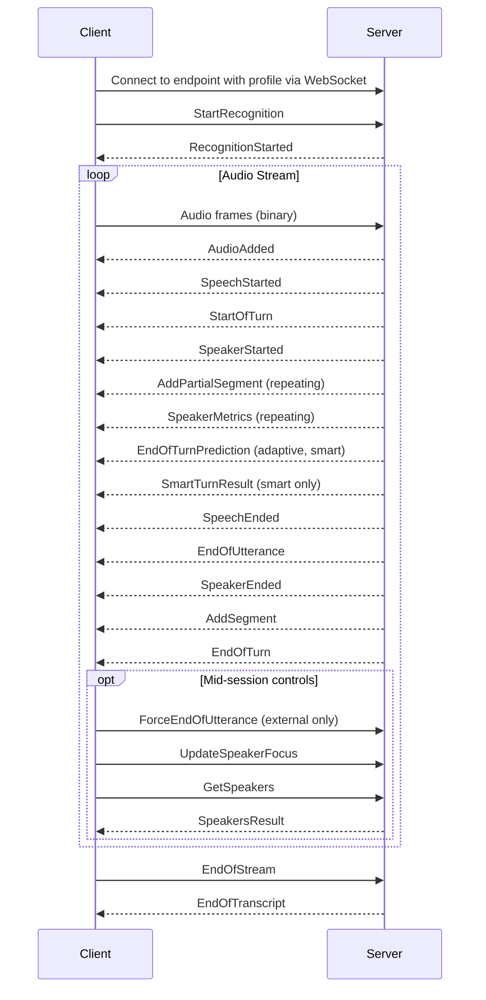

Every agent STT session follows the same structure: connect, start recognition, stream audio, receive turn events, close.

Agent STT is in [Preview](/speech-to-text/agent-stt/#preview-limitations).

## Session flow



In sequence, a session runs as follows.

1. The client connects to the endpoint for its chosen profile over a WebSocket, then sends `StartRecognition`. The server replies `RecognitionStarted`.
2. The client streams binary audio frames. The server acknowledges each with `AudioAdded`.
3. When speech is detected the server emits `SpeechStarted`, then `StartOfTurn`, then `SpeakerStarted` for the speaker who is talking.
4. While the speaker continues, the server repeatedly emits `AddPartialSegment` with the interim transcript, and `SpeakerMetrics` with per-speaker counts. The `adaptive` and `smart` profiles also emit `EndOfTurnPrediction`; `smart` additionally emits `SmartTurnResult`.
5. As the turn closes, the server emits `SpeechEnded`, `EndOfUtterance`, and `SpeakerEnded`, then `AddSegment` with the final transcript, then `EndOfTurn`.
6. At any point mid-session the client may send `ForceEndOfUtterance` (the `external` profile only), `UpdateSpeakerFocus`, or `GetSpeakers`, which the server answers with `SpeakersResult`.
7. When the client has no more audio it sends `EndOfStream`, and the server closes with `EndOfTranscript`.

`SessionMetrics` is emitted every 5 seconds, independently of turn boundaries.

## Messages sent by the client

| Message | When to send |
|---|---|
| [`StartRecognition`](#startrecognition) | First message after connecting. Starts the session and passes configuration. |
| Audio frames | Binary WebSocket frames containing raw PCM audio, sent continuously. |
| [`ForceEndOfUtterance`](#forceendofutterance) | `external` profile only. Triggers immediate turn finalization. |
| [`UpdateSpeakerFocus`](#updatespeakerfocus) | Any time during the session. Changes which speakers are in focus. |
| [`GetSpeakers`](#getspeakers) | Any time during the session. Requests voice identifiers for diarized speakers. |
| [`EndOfStream`](#endofstream) | When there is no more audio to send. |

## Messages sent by the server

These are the messages your application logic acts on.

| Message | Profile | When it is emitted |
|---|---|---|
| [`StartOfTurn`](#startofturn) | All | A speaker begins a new turn |
| [`AddPartialSegment`](#addpartialsegment) | All | Interim transcript update; each replaces the previous |
| [`AddSegment`](#addsegment) | All | Final transcript for the turn — pass this to your language model |
| [`EndOfTurn`](#endofturn) | All | Turn complete; your application can now respond |

Two messages predict the end of a turn early, so you can start preparing a response.

| Message | Profile | When it is emitted |
|---|---|---|
| [`EndOfTurnPrediction`](#endofturnprediction) | `adaptive`, `smart` | The model predicts the current turn will end soon |
| [`SmartTurnResult`](#smartturnresult) | `smart` only | High-confidence acoustic prediction of turn completion |

These messages report speech and speaker activity, independently of turn boundaries.

| Message | Profile | When it is emitted |
|---|---|---|
| [`SpeechStarted`](#speechstarted--speechended) | All | Voice activity detected in the audio stream |
| [`SpeechEnded`](#speechstarted--speechended) | All | Voice activity stopped |
| [`SpeakerStarted`](#speakerstarted--speakerended) | All | A specific diarized speaker began talking |
| [`SpeakerEnded`](#speakerstarted--speakerended) | All | A specific diarized speaker stopped talking |
| [`SpeakersResult`](#speakersresult) | All | Response to `GetSpeakers` |

These messages track the session lifecycle.

| Message | When it is emitted |
|---|---|
| `RecognitionStarted` | Session ready; emitted in response to `StartRecognition` |
| `AudioAdded` | Audio frame acknowledged |
| `EndOfTranscript` | Session closing; emitted after `EndOfStream` |

These messages carry metrics and diagnostics.

| Message | When it is emitted |
|---|---|
| [`SessionMetrics`](#sessionmetrics) | Session stats; emitted every 5 seconds and at session end |
| [`SpeakerMetrics`](#speakermetrics) | Per-speaker word count and volume; emitted on each recognized word |

## Messages shared with the Realtime API

These messages are shared with the Realtime API. For full payload details, see the [Realtime API reference](/api-ref/realtime-transcription-websocket).

| Message | When it is emitted |
|---|---|
| `EndOfUtterance` | Silence threshold reached; precedes turn finalization |
| `Info` | Non-critical informational message |
| `Warning` | Non-fatal issue, for example an unsupported config field being ignored |
| `Error` | Fatal error; the connection will close |

`RecognitionStarted`, `AudioAdded`, `AddPartialTranscript`, `AddTranscript` and `EndOfTranscript` are also shared with the Realtime API.

## Client message payloads

### StartRecognition

The first message you send after connecting. Starts the recognition session and passes configuration. The server responds with `RecognitionStarted`.

```json
{
  "message": "StartRecognition",
  "audio_format": {
    "type": "raw",
    "encoding": "pcm_s16le",
    "sample_rate": 16000
  },
  "transcription_config": {
    "language": "en"
  }
}
```

For all configuration options, see [Agent STT configuration](/speech-to-text/agent-stt/configuration).

### EndOfStream

Send when you have finished streaming audio. The server finalizes any remaining transcript and then emits `EndOfTranscript`. `last_seq_no` is the sequence number of the last audio frame you sent.

```json
{
  "message": "EndOfStream",
  "last_seq_no": 1234
}
```

### ForceEndOfUtterance

Applies to the `external` profile only. Immediately ends the current turn: the server finalizes all audio received so far and emits a single `AddSegment` containing the complete transcript for that turn, followed by `EndOfTurn`.

Send this wherever your application decides a turn is complete: on button release for push-to-talk, on VAD silence, or on a signal from your language model.

```json
{
  "message": "ForceEndOfUtterance"
}
```

### UpdateSpeakerFocus

Updates which speakers are in focus, mid-session. Takes effect immediately. See [Speaker focus and identification](/speech-to-text/agent-stt/speaker-focus) for full details.

```json
{
  "message": "UpdateSpeakerFocus",
  "speaker_focus": {
    "focus_speakers": ["S1"],
    "ignore_speakers": [],
    "focus_mode": "retain"
  }
}
```

### GetSpeakers

Requests voice identifiers for all speakers diarized so far in the session. The server responds with `SpeakersResult`.

```json
{
  "message": "GetSpeakers"
}
```

## Server message payloads

### StartOfTurn

Emitted when a speaker begins a new turn. Use this to signal to your application that it should stop speaking if it currently is.

```json
{
  "message": "StartOfTurn",
  "turn_id": 42
}
```

- `turn_id` — monotonically increasing integer; pairs with the corresponding `EndOfTurn`

### EndOfTurn

Emitted when turn detection decides the speaker has finished. This is the trigger for your application to respond. The finalized transcript for the turn is in the preceding `AddSegment`.

```json
{
  "message": "EndOfTurn",
  "turn_id": 42,
  "metadata": {
    "start_time": 0.84,
    "end_time": 3.24
  }
}
```

- `turn_id` — matches the `StartOfTurn` for this turn
- `metadata.start_time` and `metadata.end_time` — audio time range for the turn, in seconds from session start

### AddPartialSegment

Interim transcript update, emitted continuously while the speaker is talking. Each new `AddPartialSegment` replaces the previous one; do not concatenate them.

```json
{
  "message": "AddPartialSegment",
  "segments": [
    {
      "speaker_id": "S1",
      "is_active": true,
      "timestamp": "2025-01-01T12:00:00.000+00:00",
      "language": "en",
      "text": "Good evening",
      "is_eou": false,
      "metadata": {
        "start_time": 0.84,
        "end_time": 1.24
      }
    }
  ],
  "metadata": {
    "start_time": 0.84,
    "end_time": 1.24,
    "processing_time": 0.23
  }
}
```

### AddSegment

The final, complete transcript for a turn, emitted just before `EndOfTurn`. This is the stable output to pass to your language model; do not use `AddPartialSegment` for this.

In multi-speaker scenarios, a single `AddSegment` may contain segments from multiple speakers, returned in time order.

```json
{
  "message": "AddSegment",
  "segments": [
    {
      "speaker_id": "S1",
      "is_active": true,
      "timestamp": "2025-01-01T12:00:00.000+00:00",
      "language": "en",
      "text": "Good evening.",
      "is_eou": true,
      "metadata": {
        "start_time": 0.84,
        "end_time": 1.56
      }
    }
  ],
  "metadata": {
    "start_time": 0.84,
    "end_time": 1.56,
    "processing_time": 0.25
  }
}
```

Segment fields:

- `speaker_id` — speaker label, for example `S1` or `S2`, or a custom label if using [speaker identification](/speech-to-text/agent-stt/speaker-focus#recognize-a-speaker-across-sessions)
- `is_active` — `true` if this speaker is in your current focus list, `false` if they are a background speaker
- `is_eou` — `true` on final segments, `false` on partials
- `text` — clean, punctuated transcript text
- `metadata.start_time` and `metadata.end_time` — time range of this segment, in seconds from session start

Message-level fields:

- `metadata.processing_time` — transcription latency in seconds for this message

### SpeakerStarted / SpeakerEnded

Emitted when a specific speaker starts or stops being heard. These are voice activity events: they fire based on detected speech, independently of turn boundaries.

```json
{
  "message": "SpeakerStarted",
  "speaker_id": "S1",
  "is_active": true,
  "time": 0.84,
  "metadata": { "start_time": 0.84, "end_time": 0.84 }
}
```

```json
{
  "message": "SpeakerEnded",
  "speaker_id": "S1",
  "is_active": true,
  "time": 3.24,
  "metadata": { "start_time": 0.84, "end_time": 3.24 }
}
```

- `speaker_id` — the speaker whose activity changed
- `is_active` — whether this speaker is in your current focus list
- `time` — seconds from session start when the activity was detected
- `metadata.start_time` — when this speaker started their current speaking interval
- `metadata.end_time` — when this speaker stopped speaking, on `SpeakerEnded` only

### EndOfTurnPrediction

Emitted by the `adaptive` and `smart` profiles when the model predicts the current turn is about to end. Use it to begin preparing a response before `EndOfTurn` arrives, reducing perceived latency.

```json
{
  "message": "EndOfTurnPrediction",
  "turn_id": 2,
  "predicted_wait": 0.73,
  "metadata": {
    "ttl": 0.73,
    "reasons": ["not__ends_with_eos"]
  }
}
```

- `turn_id` — the turn this prediction applies to
- `predicted_wait` — estimated seconds until the turn ends
- `metadata.ttl` — time to live; how long this prediction remains valid
- `metadata.reasons` — internal signals that contributed to the prediction

### SmartTurnResult

:::warning
This message is emitted as `SmartTurnResult` during Preview. It will be renamed to `SmartTurnPrediction` at general availability.
:::

Emitted by the `smart` profile only. A higher-confidence acoustic prediction of turn completion, based on the ML model that analyzes vocal cues.

```json
{
  "message": "SmartTurnResult",
  "prediction": {
    "prediction": true,
    "probability": 0.979,
    "processing_time": 0.128
  },
  "metadata": {
    "start_time": 0.0,
    "end_time": 2.2,
    "language": "en",
    "speaker_id": "S1",
    "total_time": 2.2
  }
}
```

- `prediction.prediction` — `true` if the model predicts the turn is complete
- `prediction.probability` — confidence score from 0 to 1
- `prediction.processing_time` — time taken by the ML model, in seconds
- `metadata.start_time` and `metadata.end_time` — audio window analyzed
- `metadata.total_time` — total session time at the point of prediction
- `metadata.speaker_id` — speaker being analyzed, or `null` if not yet identified

### SpeechStarted / SpeechEnded

Voice activity detection events, emitted when speech is first detected in the audio stream or stops. These fire independently of speaker identity and turn boundaries.

```json
{
  "message": "SpeechStarted",
  "probability": 0.508,
  "transition_duration_ms": 192.0,
  "metadata": {
    "start_time": 2.1,
    "end_time": 2.1
  }
}
```

```json
{
  "message": "SpeechEnded",
  "probability": 0.307,
  "transition_duration_ms": 192.0,
  "metadata": {
    "start_time": 0.4,
    "end_time": 2.5
  }
}
```

- `probability` — VAD confidence score from 0 to 1
- `transition_duration_ms` — duration of the speech or silence transition, in milliseconds
- `metadata.start_time` — when speech began. On `SpeechStarted` this equals `end_time`; on `SpeechEnded` it is when the speaking interval started
- `metadata.end_time` — when the event was detected

### SpeakersResult

Emitted in response to `GetSpeakers`. Contains voice identifiers for all speakers diarized so far. See [Speaker focus and identification](/speech-to-text/agent-stt/speaker-focus#recognize-a-speaker-across-sessions) for how to store and use these.

```json
{
  "message": "SpeakersResult",
  "speakers": [
    { "label": "S1", "speaker_identifiers": ["<id1>"] },
    { "label": "S2", "speaker_identifiers": ["<id2>"] }
  ]
}
```

### SessionMetrics

Emitted every 5 seconds and once at the end of the session.

```json
{
  "message": "SessionMetrics",
  "total_time": 4.6,
  "total_time_str": "00:00:04",
  "total_bytes": 148480,
  "processing_time": 0.295
}
```

### SpeakerMetrics

Emitted each time a speaker produces a recognized word.

```json
{
  "message": "SpeakerMetrics",
  "speakers": [
    {
      "speaker_id": "S1",
      "word_count": 6,
      "last_heard": 2.36,
      "volume": 5.2
    }
  ]
}
```
