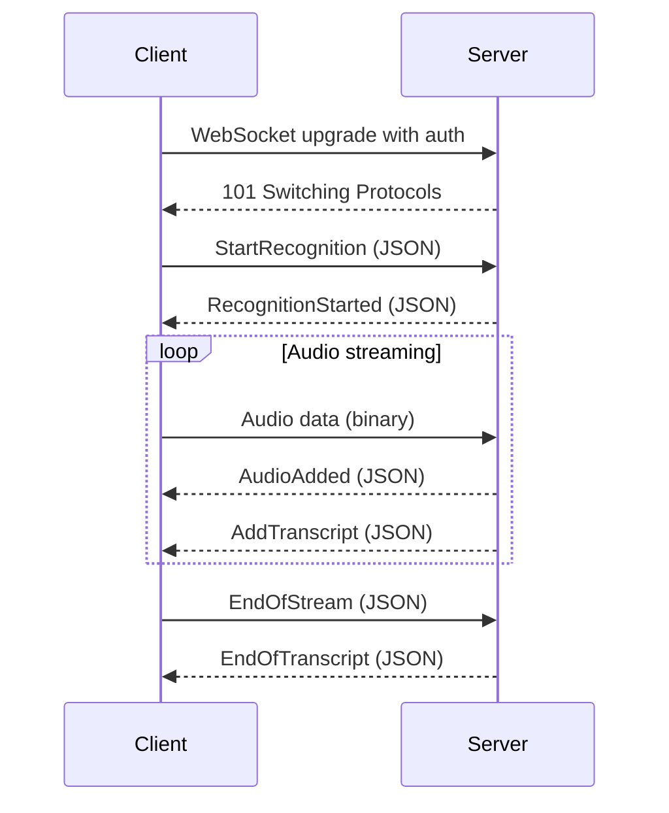

import { LinkCard } from "@site/src/theme/LinkCard";
import { Grid } from "@radix-ui/themes";
import { BookOpen, ChevronsRight } from "lucide-react";

# WebSocket protocol guide

This guide walks through the raw WebSocket message flow for the Speechmatics Realtime API. It is intended for developers who want to understand the protocol before using one of the available SDKs, or who are building a client in a language without an official SDK (Go, Rust, Java, etc.).

For SDK-based quickstarts, see the [Realtime quickstart](/speech-to-text/realtime/quickstart).

## Prerequisites

- A Speechmatics API key — [create one here](https://portal.speechmatics.com/settings/api-keys)
- A WebSocket client capable of sending both JSON text frames and binary frames
- A sample audio file — see [Prepare a sample audio file](#prepare-a-sample-audio-file) below

:::info
This guide shows the raw WebSocket messages themselves, not tool-specific commands. You can use any WebSocket library or client in your preferred language.
:::

## Protocol overview

The Realtime API uses a WebSocket connection. Control messages (session setup, acknowledgements, transcripts) are JSON text frames. Audio data is sent as binary frames.



## Connect

{/* <!-- SME-REVIEW: Confirm eu.rt.speechmatics.com is canonical. Both Python and JS SDKs default to eu2.rt.speechmatics.com. --> */}

### Endpoint

Connect to the Realtime WebSocket API at:

```
wss://eu.rt.speechmatics.com/v2
```

A US endpoint is also available at `wss://us.rt.speechmatics.com/v2`. See the [full endpoint list](/get-started/authentication#supported-endpoints) for all regions.

{/* <!-- SME-REVIEW: Python SDK appends language to path (/v2/en). JS SDK and API reference use /v2/ only. Confirming /v2/ is correct for raw WebSocket clients. --> */}

### Authentication

**Server-side:** Pass your API key as a Bearer token in the WebSocket upgrade request headers:

```
GET /v2 HTTP/1.1
Host: eu.rt.speechmatics.com
Upgrade: websocket
Connection: Upgrade
Authorization: Bearer YOUR_API_KEY
```

**Browser-side:** Browsers cannot set custom headers on WebSocket connections. Use a [temporary key](/get-started/authentication#temporary-keys) passed as a query parameter instead:

```
wss://eu.rt.speechmatics.com/v2?jwt=TEMPORARY_KEY
```

To generate a temporary key:

```bash
curl -L -X POST "https://mp.speechmatics.com/v1/api_keys?type=rt" \
     -H "Content-Type: application/json" \
     -H "Authorization: Bearer $API_KEY" \
     -d '{"ttl": 60}'
```

The response contains a `key_value` field with your temporary key, valid for the specified TTL (in seconds).

### Successful handshake

A successful WebSocket upgrade returns:

```
HTTP/1.1 101 Switching Protocols
Connection: upgrade
Upgrade: WebSocket
```

If the handshake fails, you'll receive one of:
- `400 Bad Request` — malformed request
- `401 Unauthorized` — invalid API key
- `405 Method Not Allowed` — non-GET request method

## Message lifecycle

### 1. Start the session

After the WebSocket connection is open, send a `StartRecognition` JSON message to begin transcription.

**Minimal example (raw PCM audio):**

```json
{
  "message": "StartRecognition",
  "audio_format": {
    "type": "raw",
    "encoding": "pcm_s16le",
    "sample_rate": 16000
  },
  "transcription_config": {
    "language": "en"
  }
}
```

**With common options:**

```json
{
  "message": "StartRecognition",
  "audio_format": {
    "type": "raw",
    "encoding": "pcm_s16le",
    "sample_rate": 16000
  },
  "transcription_config": {
    "language": "en",
    "operating_point": "enhanced",
    "max_delay": 2.0,
    "enable_partials": true
  }
}
```

#### `audio_format` fields

| Field | Description |
|-------|-------------|
| `type` | `"raw"` for raw PCM audio, or `"file"` for container formats (wav, mp3, ogg, flac, etc.) |
| `encoding` | Required when `type` is `"raw"`. One of: `pcm_s16le`, `pcm_f32le`, `mulaw` |
| `sample_rate` | Required when `type` is `"raw"`. Sample rate in Hz (e.g., `16000`, `44100`) |

When using `"type": "file"`, the server detects the encoding and sample rate from the file headers. No `encoding` or `sample_rate` fields are needed:

```json
{
  "audio_format": { "type": "file" }
}
```

See the [API reference: StartRecognition](/api-ref/realtime-transcription-websocket#startrecognition) for the full schema including translation and audio events configuration.

### 2. Receive session confirmation

The server responds with a `RecognitionStarted` message:

```json
{
  "message": "RecognitionStarted",
  "id": "807670e9-14af-4fa2-9e8f-5d525c22156e",
  "language_pack_info": {
    "adapted": false,
    "itn": true,
    "language_description": "English",
    "word_delimiter": " ",
    "writing_direction": "left-to-right"
  }
}
```

The `id` field is the unique session identifier. Do not send audio until you receive this message.

:::info
The server may also send `Info` messages immediately after the handshake, reporting recognition quality and concurrent session usage. These are informational and do not require a response.
:::

### 3. Stream audio data

Send audio as **binary WebSocket frames**. Each frame contains raw audio bytes — there is no JSON wrapper. A chunk size of around 4096 bytes works well.

The server acknowledges each audio chunk with an `AudioAdded` JSON message:

```json
{
  "message": "AudioAdded",
  "seq_no": 1
}
```

The `seq_no` increments with each chunk received. Keep track of the latest `seq_no` — you'll need it when ending the session.

#### Backpressure

If you send audio faster than real-time, unacknowledged chunks can pile up. The server buffers incoming audio internally, but if that buffer fills, TCP-level buffers will also fill, eventually causing write failures and connection closure.

To avoid this, track how many chunks you've sent versus how many `AudioAdded` acknowledgements you've received. If the gap grows too large, pause sending until the server catches up. The Python SDK caps this at 512 outstanding unacknowledged chunks, with a 120-second timeout waiting for an acknowledgement before giving up. These are reasonable starting points for your own implementation, but the exact values are an implementation choice.

:::tip
A simple approach: maintain a counter that increments when you send a chunk and decrements when you receive an `AudioAdded`. If the counter exceeds your chosen limit, wait before sending the next chunk.
:::

### 4. Receive transcripts

As audio is processed, the server sends `AddTranscript` messages with finalized transcription results:

```json
{
  "message": "AddTranscript",
  "format": "2.9",
  "metadata": {
    "start_time": 0.54,
    "end_time": 2.1,
    "transcript": "Hello world."
  },
  "results": [
    {
      "type": "word",
      "start_time": 0.54,
      "end_time": 0.96,
      "alternatives": [
        { "content": "Hello", "confidence": 0.99 }
      ]
    },
    {
      "type": "word",
      "start_time": 1.02,
      "end_time": 1.5,
      "alternatives": [
        { "content": "world", "confidence": 0.98 }
      ]
    },
    {
      "type": "punctuation",
      "start_time": 1.5,
      "end_time": 1.5,
      "alternatives": [
        { "content": ".", "confidence": 1.0 }
      ]
    }
  ]
}
```

The `metadata.transcript` field contains the pre-formatted text. The `results` array provides word-level timing and confidence scores.

If you enabled `enable_partials` in your `transcription_config`, you'll also receive `AddPartialTranscript` messages. These have the same structure but may be revised as more audio is processed. Use partials for low-latency display, then replace them with finals as they arrive.

See the [output documentation](/speech-to-text/realtime/output) for details on latency tuning with `max_delay`.

### 5. End the session

When you've finished sending audio, send an `EndOfStream` message. Set `last_seq_no` to the `seq_no` from the last `AudioAdded` message you received:

```json
{
  "message": "EndOfStream",
  "last_seq_no": 42
}
```

The server will finalize any remaining transcripts and respond with:

```json
{
  "message": "EndOfTranscript"
}
```

After receiving `EndOfTranscript`, close the WebSocket connection.

## Prepare a sample audio file

To test the protocol, you need an audio file to stream.

**Option A: Use a pre-recorded file**

Download the [example.wav](https://github.com/speechmatics/speechmatics-js-sdk/raw/7d219bfee9166736e6aa21598535a194387b84be/examples/nodejs/example.wav) sample file. When using a `.wav` file, set `audio_format` to `{ "type": "file" }` in your `StartRecognition` message.

{/* <!-- SME-REVIEW: Consider hosting a .raw PCM sample file for direct download to simplify testing with raw audio format. --> */}

**Option B: Generate raw PCM audio**

Convert any audio file to raw PCM using `ffmpeg`:

```bash
ffmpeg -i input.wav -f s16le -acodec pcm_s16le -ar 16000 -ac 1 output.raw
```

When using raw PCM, set `audio_format` to:

```json
{ "type": "raw", "encoding": "pcm_s16le", "sample_rate": 16000 }
```

## Error handling

If an error occurs, the server sends an `Error` JSON message followed by a WebSocket close. Common close codes:

| Close code | Payload | Description |
|-----------|---------|-------------|
| 1003 | `protocol_error` | Malformed or unexpected message |
| 1011 | `internal_error` | Server error |
| 4001 | `not_authorised` | Invalid API key |
| 4005 | `quota_exceeded` | Maximum concurrent connections reached |
| 4013 | `job_error` | Server unable to process the job |

:::tip
For `4005 quota_exceeded`, `4013 job_error`, and `1011 internal_error`, wait 5-10 seconds before retrying.
:::

See the [API reference: WebSocket errors](/api-ref/realtime-transcription-websocket#websocket-errors) for the full list of close codes.

## Next steps

<Grid columns={{initial: "1", md: "2"}} gap="3">
  <LinkCard
    title="API reference"
    description="Full message schemas and detailed field descriptions"
    href="/api-ref/realtime-transcription-websocket"
    icon={<BookOpen/>}
  />
  <LinkCard
    title="SDK quickstart"
    description="Get started faster with the Python or JavaScript SDK"
    href="/speech-to-text/realtime/quickstart"
    icon={<ChevronsRight/>}
  />
</Grid>
